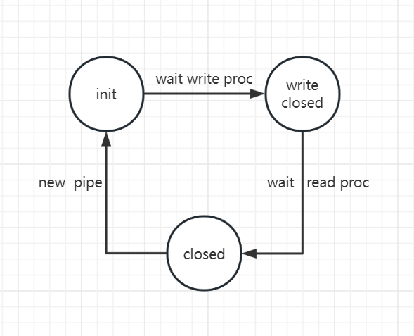

# lab1-shell 设计思路

### 1、shell指令实现

**关于参数的处理**

考虑用一个参数信号数组，数组的每个元素标记指令是否指定该参数，通过if判断并作出对应的处理，例如：

```c
#define ARGV_CNT 1
#define ARGV_n 0

static char params[ARGV_CNT];

// ...
if (params[ARGV_n] == 1)
{
    // do something
}
// ...
```

**pwd**

指令模式：`pwd [options]`；

将当前工作目录全路径输出到标准输出。

实现思路：

在`main.c`中调用`getcwd()`函数得到当前全路径并输出到标准输出。

**echo**

指令格式：`echo [options] [string]`；

将string的内容输出到标准输出。

options

实现`-n`参数，取消输出最后的换行符。

实现思路：

在`main.c`中逐个解析`argv`直到遇到第一个非option项，将前面的option项设置到对应的params数组元素。随后逐个输出argv，空格隔开。若`params[ARGV_n]`被设置则不输出换行符。

**cat**

指令格式：`cat [options] [file]`；

将file的内容输出到标准输出。

实现思路：

打开指定file，并用read一次读取大量数据，随后逐个字符输出。

**ls**

指令格式：`ls [options] [directory]`；

列出指定目录下的文件信息，若未指定目录信息，则列出当前工作目录下的文件信息。

**less**

**grep**

### 2、shell实现

##### 2.1 获取并处理用户输入的指令

**单一指令**

用一个结构体command管理用户输入的指令，结构体及其接口如下：

```c
#define COMMAND_NAME_SIZE 16

typedef struct command
{
    char name[COMMAND_NAME_SIZE];		// 指令对应的可执行文件名，处理ls -l和ll这种对应同一elf文件的情况
    char** argv;						// line中参数二级指针
   	int argc;							// line中参数的个数
} Command;

int getCommand(const char* line, Command* command);		// 由用户输入的line，填充一个command对象
void freeCommand(Command* cmd);							// 释放command管理的空间，主要空间在argv
```

在shell的主程序中，通过`getline()`函数获取用户的一行输入，将该字符串作为`getCommands()`的参数，由其解析字符串得到一系列command对象，command中封装了后续通过exec执行的文件名`name`及其对应的进程参数`argv`，参数个数`argc`主要是为了在释放内存空间时便于管理，专门设置一个看似多余的`name`属性一方面是为了处理不同指令执行同一个elf文件的情况，另一方面是为了便于结合校验指令是否合法的操作。

由`getCommand()`解析后的command对象中封装了shell进程后续处理该指令实现时需要用到的**所有参数**，目前包括`name`和`argv`。调用该函数后shell可以方便地通过command对象管理子进程的执行需求，返回值反映指令是否正常。

**多个指令**

考虑到用户输入的一行可能要执行多个可执行文件，即两条或多条由特殊符号连接（目前有两种连接：指令结束符`;`与管道符`|`）。由于shell的主程序框架中，调用`getCommand()`对用户输入的字符串line进行解析，有且仅有这一次解析过程，需要在这一次解析过程中得到多个command，因此调整`getCommand()`函数为`getCommands()`，并调整`freeCommand()`为`freeCommands()`从而一次性释放所有command管理的空间。

由于两种指令连接符（`;`和`|`）的区别，前者只需要执行两个指令即可，后者需要shell进程的介入进行调整（调整输入和输出），这种控制需要反映在平行于command数组控制信号上，由此使用一个signal数组，用来区分每两个指令间的连接过程，shell进程访问该数组确定自己的行为。

调整后如下：

```c
#define COMMAND_NAME_SIZE 16

typedef struct command
{
    char name[COMMAND_NAME_SIZE];		// 指令对应的可执行文件名，处理ls -l和ll这种对应同一elf文件的情况
    char** argv;						// line中参数二级指针
   	int argc;							// line中参数的个数
} Command;

// 由用户输入的line，填充commands与signal
int getCommands(const char* line, Command* commands, int* signals);	
// 释放count个command管理的空间，主要空间在argv
void freeCommand(Command* cmd, int count);
```

当遇到多个指令时，shell在逻辑上应该逐个执行对应指令，从前到后。

##### 2.2 管道符操作的处理

用户输入的一行中可以由管道符连接，管道符的含义是创建一个管道pipe，该管道用于进程间通信，写入和读出的两个文件描述符分别作为两个指令进程的标准输出和标准输入文件描述符。逻辑如此，实现起来需要shell在子进程exec前介入进行预处理，调整其`STDOUT`和`STDIN`文件描述符，该过程统一使用的接口：

```c
int dup2(int oldfd, int newfd);	// newfd -> oldfd
```

因此，在预处理阶段shell进程需要检验管道符的存在，当检测到管道符时（访问对应的`signals`数组）对子进程进行预处理调整标准输入和标准输出。代码逻辑如下（没有经过封装，后续可能有改动）：

```c
int main(int argc, char const* argv[])
{
    // ... get and parse input
    
    // make pipe: int pipe(int pipefd[2])
    int pipe_fd[2];
   	pipe(pipe_fd);	// pipe_fd[0]: read; pipe_fd[1]: write;
    
    // fork: pid_t fork(void)
    pid_t pid = fork();
    // child proc
    if (pid == 0)
    {
        // int close(int fd); int dup(int oldfd)
        // change stdout: STDOUT_FILENO
        if (out)
        {
            // set new stdout; logic: close(STDOUT_FILENO) & dup(pipe_fd[1]);
            dup2(pipe_fd[1], STDOUT_FILENO);
            close(pipe_fd[0]);
            close(pipe_fd[1]);
        }
        // change stdin: STDIN_FILENO
        else if (in)
        {
            // set new stdin; logic: close(STDIN_FILENO) & dup(pipe_fd[0]);
            dup2(pipe_fd[0], STDIN_FILENO);
            close(pipe_fd[0]);
            close(pipe_fd[1]);
        }
        
        // exec
    }
    // parent proc ...
}
```

父子进程对pipe的文件描述符控制：

- 父进程shell创建出一个管道pipe，并填充`pipe_fd[2]`；
- 父进程fork出第一个子进程，子进程同样拥有`pipe_fd[2]`两个描述符；
- 第一个子进程将`STDOUT_FILENO`调整为`pipe_fd[1]`，并关闭`pipe_fd[0]`和`pipe_fd[1]`（后续用标准输出操作pipe）；
- 父进程fork出第二个子进程，子进程同样拥有`pipe_fd[2]`两个描述符；
- 第二个子进程将`STDIN_FILENO`调整为`pipe_fd[0]`，并关闭`pipe_fd[0]`和`pipe_fd[1]`（后续用标准输入操作pipe）；
- 父进程关闭`pipe_fd[0]`和`pipe_fd[1]`；

##### 2.3 重定向操作的处理

对于一条指令，用户可以通过`n > file`和`n >> file`重定向文件描述符，且可以通过`command >(>) file`与`command <(<) file`快捷地重定向输出（`STDOUT_FILENO`）和输入（`STDIN_FILENO`）文件。无论是**指定描述符进行重定向**或是**快捷重定向标准输入输出**，都使用`dup()`函数修改进程的文件描述符，后者将封装后的快捷指令重新解析为重定向指定描述符的格式。

在shell进程的视角里，该过程需要的预处理信息包括：

- 进行重定向的文件描述符（不需要重定向则为-1）
- 重定向的文件名
- 重定向的文件打开方式（Overwrite/Append）

该过程需要额外地打开文件，应该封装起来：

```c
void redirect(int fd, const char* filename, int mode);		// 将指定描述符重定向到指定文件
```

该函数分为三个过程：按照指定的文件打开方式打开文件得到文件描述符`oldfd`；调用`dup2(oldfd, fd)`进行重定向操作；关闭`oldfd`描述符。

考虑该函数需要的参数来源：由于只通过`getCommands()`函数进行一次原字符串的解析，因此需要在`getCommands()`中加入重定向操作的信息（重定向的文件描述符，重定向的文件名，重定向的文件打开方式），这些是shell进程预处理阶段需要的参数。封装如下结构体：

```c
enum redirect_mode_t {Overwrite, Append};

typedef struct redirect
{
    int fd;
    const char* filename;
    enum redirect_mode_t mode;
} Redirect;
```

一行输入中可能由多条指令，每条指令对应的进程可能有多个重定向操作。不同指令组织为了一个Command数组，可以在command对象中嵌入该指令对应的一系列重定向操作参数，调整后如下：

```c
typedef struct command
{
    // child proc
    char name[COMMAND_NAME_SIZE];		// 指令对应的可执行文件名，处理ls -l和ll这种对应同一elf文件的情况
    char** argv;						// line中参数二级指针
   	int argc;							// line中参数的个数
    // shell proc
    Redirect* redirects;				// 该指令需要进行的一系列重定向操作
    int redirectc;						// 重定向操作的个数，便于回收内存
} Command;

// 由用户输入的line，填充commands与signal
int getCommands(const char* line, Command* commands, int* signals);	
// 释放count个command管理的空间，主要空间在argv和redirects
void freeCommands(Command* cmd, int count);
```

可以这样理解command对象：command对象封装了一条用户指令执行时需要的所有信息，包括shell进程在进行预处理时需要的参数（重定向参数）以及子进程调用exec执行指令时需要的参数（elf文件名，以及对应参数）。

由此，shell进程的行为可以描述为：循环读取用户输入的一行字符串；调用`getCommands()`解析该字符串，得到一系列command对象以及连接这些command对象的连接信号。fork出子进程，在子进程预处理时，根据command对象的redirects参数进行重定向，同时检测管道符的存在，创建pipe并进行重定向；预处理结束后进行调用`exec()`替换进程内容执行用户指令。

##### 2.4 广义重定向

管道符和重定向符，本质上都是一种文件描述符重定向，即都涉及`redirect()`函数的调用，当前的设计下管道符的实现由`signals`控制，重定向符的实现由`Redirect`对象控制，接口不统一，考虑将其合并为广义的重定向操作。

当前重定向的接口为`void redirect(int fd, const char* filename, int mode)`，只适用于指定文件的重定向。为了扩展为多种类的重定向，将其由具体的参数修改为抽象的参数（**依赖抽象而不依赖具体**）：

```c
void redirect(const Redirect* redirect);
```

同时需要修改Redirect对象令其兼容管道符重定向。管道符重定向需要参数为管道的描述符以及需要重定向的描述符：

```c
enum redirect_type {File, Pipe};
enum redirect_mode_t {Overwrite, Append};

typedef struct redirect
{
    union {
        struct {
            int fd;
            const char* filename;
            enum redirect_mode_t mode;
        } file;
        struct {
          	int fd;
            int pipe_fd[2];					// parent proc alloc pipe fd;
            char write;						// is child proc write proc?
        } pipe;
    } info;
    enum redirect_type type;
} Redirect;
```

为便于管理管道符操作，在shell进程中为进程间创建的管道维护一个状态机：



shell遇到管道符时会创建pipe，进入`init`状态；启动管道符前面的进程（写进程），wait该进程后进入`write closed`状态（此时不会真正的关闭pipe的端口，只是做一个标记）；启动管道符后面的进程（读进程），wait该进程后进入`closed`状态，关闭pipe的两个端口，释放pipe的空间。

```c
enum pipe_state {P_INIT, P_WRITECLOSED, P_CLOSED, P_DESTORY};

void initPipe(enum pipe_state* state);
void updatePipe(enum pipe_state* state);
```

另一个问题：shell靠什么识别何时该创建管道？因为管道符的检查是在`getCommands()`中，该函数的输出是一系列command对象，shell会逐个读取command对象进行预处理并执行对应的可执行文件，同样也需要读取command对象判断是否创建管道。因此command对象应该标识该指令是否需要创建管道，调整如下：

```c
typedef struct command
{
    // child proc
    char name[COMMAND_NAME_SIZE];		// 指令对应的可执行文件名，处理ls -l和ll这种对应同一elf文件的情况
    char** argv;						// line中参数二级指针
   	int argc;							// line中参数的个数
    // shell proc
    Redirect* redirects;				// 该指令需要进行的一系列重定向操作
    int redirectc;						// 重定向操作的个数，便于回收内存
    unsigned char pipe;					// 是否需要创建pipe，最后一个redirect对象为pipe的重定向
} Command;

// 由用户输入的line，填充commands与signal
int getCommands(const char* line, Command* commands);	
// 释放count个command管理的空间，主要空间在argv和redirects
void freeCommands(Command* cmd, int count);
```

##### 2.5 错误处理

主要错误产生在`getCommands()`函数，可能产生多种错误，利用其返回值作为`errno`，非负代表正常解析无错误（数值为解析得到的指令个数）；其余数字与预定义的出错码进行比较，得到产生错误的原因。

```c
#define ERR_xxx xxx
```

##### 2.6 shell的代码框架

shell进程执行的基本逻辑为：

1. 启动程序**循环**读取用户输入的一行指令；
2. 读取并解析指令后**fork**出一个子进程；
3. 由shell进程对子进程进行**预处理**过程，如调整标准输入输出的描述符；
4. 通过**exec**令其执行对应的elf文件从而得到指令的运行结果；

代码实现：

```c
int main()
{
    // define some variable ...
    
    while (1) 
    {
        line = getline();			/* get user input */
        int cnt = getCommands(commands, line);
        
        if (cnt < 0) 
        {
            // TODO: error handler
        }
        /* execute each command */
        for (int i = 0; i < cnt; i++)
        {
            Command command = commands[i];
            
            /* pipe */
            if (command.pipe)
            {
                if (pipe(pipe_fd) < 0)
                {
                    // TODO: error handler
                }
                /* write proc */
                command.redirects[command.redirectc - 1].pipe_fd = pipe_fd[1];
                /* read proc */
                commands[i + 1].redirects[command.redirectc - 1].pipe_fd = pipe_fd[0];
                /* init pipe state */
                initPipe(&pstate);
            }
            
            /* fork */
            pid_t pid = fork();
            
            /* child proc */
            if (pid == 0)
            {
                /* preprocess: redirect */
                Redirect* redirects = command.redirects;
                for (int j = 0; j < command.redirectc; j++)
                {
                    redirect(redirects + j);
                    /* close pipe in child proc */
                    if (redirects[j].type == Pipe)
                    {
                        close(pipe_fd[0]);
                        close(pipe_fd[1]);
                    }
                }
                /* exec */
                execlp(command.name, ...);
            }
            /* parent proc */
            else
            {
                /* wait for child proc */
                wait();
                /* update pipe state and close pipe in parent proc */
                updatePipe(&pstate);
                if (pstate == P_CLOSED)
                {
                    close(pipe_fd[0]);
                    close(pipe_fd[1]);
                }
            }
        }
    }
  	return 0;  
};
```

